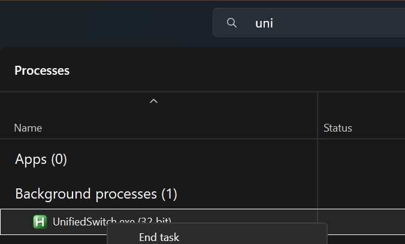

# UnifiedSwitch

Instant Logitech MX keyboard + mouse + monitor switching between multiple PCs for power users

## Installation

1. [Download latest release](https://github.com/tommaso-zambon/unified-switch/releases/latest)
2. Put these two files into the `dependencies/` folder:
   - [hidapitester.exe](https://github.com/todbot/hidapitester/releases/latest)
   - [ControlMyMonitor.exe](https://www.nirsoft.net/utils/control_my_monitor.html) (optional, only needed for monitor switching)
3. Run as admin `install.bat` -> it creates a startup task
4. Reboot or run `UnifiedSwitch.exe` once -> Done forever!

`uninstall.bat` removes everything cleanly.

> [!IMPORTANT]
> Install this repo to every device you want to use this with.

## Features

press `⊞ Win + 1`, `⊞ Win + 2`, `⊞ Win + 3`

each shortcut will switch keyboard and mouse channel:

- `Win+1` switches keyboard and mouse channels to 1
- `Win+2` switches keyboard and mouse channels to 2
- `Win+3` switches keyboard and mouse channels to 3

if `multiMonitor` property in `config.ini` file is set to `0` it will also switch monitor source automatically.

> [!NOTE]
> if you use a multiple screen setup then in config.ini change `multiMonitor` from `0` to `1`. This will disable monitor source switching.<br>
> If it does not work your monitor isn't supporting DDC/CI operations.

## How to find your monitor input codes

Do this **once per Monitor**, you'll never need to do it again.

1. Open **PowerShell** (no admin needed)
2. Paste and run this one-liner

```powershell
1..20 | ForEach-Object { Write-Host "Testing input $_ (watch monitor – Ctrl+C to stop)" -ForegroundColor Yellow; & "C:\Macros\UnifiedSwitch\dependencies\ControlMyMonitor.exe" /SetValue "\\.\DISPLAY1\Monitor0" 60 $_; Start-Sleep -Seconds 2 }
```

3. When source switch write down the number shown (examples)

   - input 5 => HDMI-1
   - input 6 => HDMI-2
   - input 17 => DP-1

4. Open config.ini and put them here:

```ini
[SOURCES]
device1=5    ; your number for HDMI-1
device2=6    ; your number for HDMI-2
device3=17   ; your number for DP-1
```

That's it. Save and restart process like in the image (use task manager)

<br>
-> press Win+1 / Win+2 / Win+3. Everything switches perfectly forever.

## Supported Connections

| Device                  | Connection             | Easy-Switch works? |
| ----------------------- | ---------------------- | ------------------ |
| MX Keys / MX Mechanical | **Bluetooth direct**   | YES                |
| MX Keys / MX Mechanical | **Logi Bolt receiver** | NOT TESTED         |
| MX Master 3 / 3S        | **Bluetooth direct**   | YES                |
| MX Master 3 / 3S        | **Logi Bolt receiver** | NO                 |

> [!TIP]
> Use **direct Bluetooth pairing** on every PC (no dongle).  
> You get lower latency, longer battery life, and 100 % working channel switching with this script.

## Credits & huge thanks

todbot/hidapitester<br>
nirsoft/ControlMyMonitor
